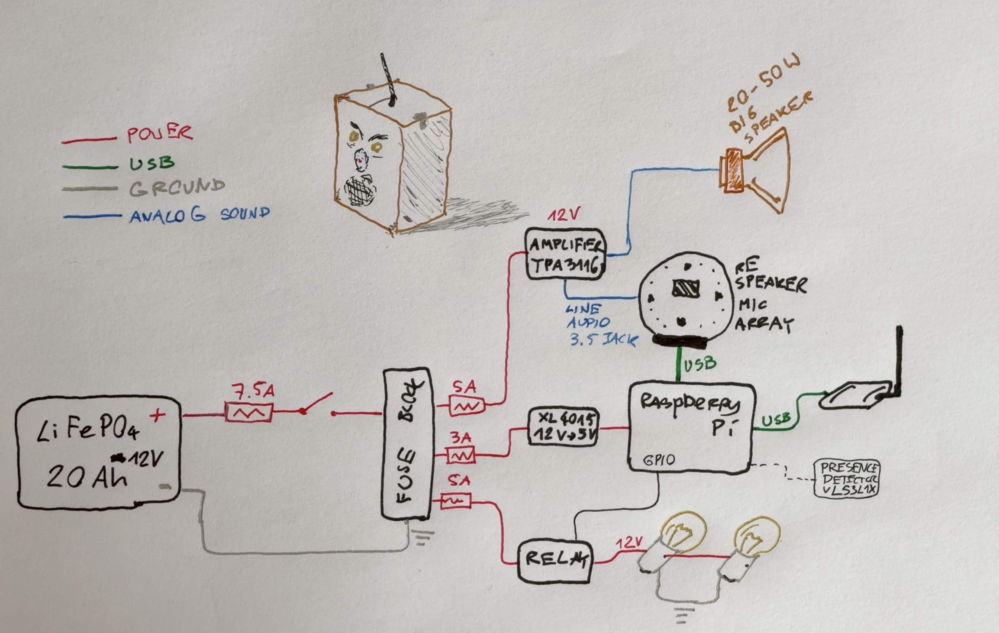

# Frustrated Box

Fully offline (no Internet!) conversational bot to serve as a Halloween prop.

Uses only LOCAL AI models for reasoning, speech understanding, speech production. Raspberry Pi is the edge node living inside the box and orchestrating the flow. A more powerful computer with a GPU on the same home LAN does the heavy lifting of reasoning and speech recognition/generation.

We can give it any character by a simple prompt stored in a txt file, but by design for this (2026) Halloween it is going to be a parcel misdelivered by a courier (it was addressed to a villa in the Bahamas, it got to Ireland), now sitting frustrated by the front door: hears people talking, reacts with responses and glowing bulb eyes, and holds a spoken conversation in a frustrated-but-playful character, powered by a local STT → LLM → TTS pipeline. No cloud services, no information exchanged with the Internet.

See the bot in action in this YouTube video:

[](https://youtu.be/7HzCIBPl4T8)

## Architecture

Two machines over the home LAN:

- **Edge client** — Raspberry Pi 5 inside the box: audio I/O (ReSpeaker 4-mic array with hardware echo cancellation), Silero VAD, turn-taking, orchestration ([Pipecat](https://github.com/pipecat-ai/pipecat)), and the relay-driven 12V bulb eyes. No model inference.
- **Backend** — a Linux PC with a GPU serving OpenAI-compatible endpoints:
  faster-whisper large-v3-turbo (STT) and Kokoro (TTS) via [speaches](https://github.com/speaches-ai/speaches),
  and Dolphin 3.0 Llama 3.1 8B (LLM) via llama.cpp's `llama-server`.

The backend was developed and tested on an RTX 4090, but the lift is small enough that it can probably run on a much older GPU.

## Quick start

```bash
# Backend (the GPU workstation): llama-server on :8091, speaches container on :8000
llama-server -m ~/path_to_models/Dolphin3.0-Llama3.1-8B-Q5_K_M.gguf -ngl 99 -c 8192 --host 0.0.0.0 --port 8091 --flash-attn on --cont-batching # I run it from tmux; get the latest llama.cpp package (it updates very frequently)
docker start speaches

# Client (Pi, this repo)
source venv/bin/activate
cp config.sample.toml config.toml # first run only — then edit: backend IPs, audio, GPIO
python loop.py                    # or: --no-eyes, --volume N, --personality FILE
```

Client prerequisites (one-time: venv, lgpio symlink, `~/.asoundrc` for the ReSpeaker) are in detail below.

# More Detail: Design & Architecture
## 1. System overview

Two pieces talk over WiFi/LAN:

- **Edge client** — runs inside the box (Raspberry Pi 5). Handles audio I/O, voice-activity detection, turn-taking, and the conversation orchestration. No inference is happening here. I tried running speech generation (Kokoro) on the Pi first, but hit performance issues. I may come back to this topic; may also re-think what I really want for the edge node. I also have this crazy idea of storing everything (including LLM reasoning) on the node, but then need a much more powerful node, and much sleeker reasoning model.
- **Backend** — a workstation with an RTX 4090 in my case, but the inference here is light, so any reasonable GPU should do. Runs the heavy models (TTS, STT, LLM) as network services.

### Voice pipeline (current, working — Pi)

```
            ┌──────────────────── client (Raspberry Pi 5) ─────────────────────┐
  mic ──► transport.input ──► MicGate ──► Silero VAD (0.2s silence = turn end) ──► turn end
                                                                              │ HTTP
                                                                              ▼
                                          STT — faster-whisper large-v3-turbo via speaches (GPU on a Linux PC)
                                                                              │ text
                                                                              ▼
                                          LLM — Dolphin 3.0 (Llama 3.1 8B) via llama-server (GPU on a Linux PC)
                                                                              │ reply (streamed)
                                                                              ▼
                                          TTS — Kokoro (82M) via speaches (GPU on a Linux PC)
                                                                              │ PCM audio (streamed)
  speaker ◄── TPA3116 amp ◄── ReSpeaker line-out ◄── transport.output ◄──────┘
```

MicGate is a volume-based gate: while the bot speaks, it passes loud audio (human barge-in) and drops quiet audio (residual echo that survives the ReSpeaker hardware AEC). `interrupt_rms_threshold` in `config.toml` controls the boundary.

---

## 2. Hardware architecture 

Full hardware list with notes in [this BOM file](BOM.md).



## 3. Software components & rationale

- **Orchestrator: Pipecat (v1.3.0).** Handles the real-time pipeline, VAD, turn taking, interruptions/barge-in, and provides swappable service classes. Initially I thought I'd write the pipeline manually but when researching I found this treasure library!
- **STT: faster-whisper `large-v3-turbo`** served by **speaches** (OpenAI-compatible STT/TTS server) on the GPU. `turbo` = near-large-v3 accuracy at ~8× speed; runs on GPU. (`large` = top size tier, `v3` = latest version, `turbo` = decoder pruned to 4 layers.)
- **LLM: Dolphin 3.0 — Llama-3.1-8B** (`Dolphin3.0-Llama3.1-8B-Q5_K_M.gguf`, a Dolphin 3.0 instruct fine-tune of Llama 3.1 8B) via llama-server (llama.cpp), OpenAI-compatible, kept "warm" on the GPU -- I want it to be ready to respond. **Deliberately small** — voice needs low latency, not deep reasoning. In future I may think of 2-layer approach, keep small model for 'small talk' but have a larger model do slower but deeper thinking to arrive at future conclusuions? This is TBC.
- **TTS: Kokoro (82M)**, served by **speaches on the GPU** via `OpenAITTSService` (OpenAI-compatible TTS endpoint). I tried local inference on Pi but was too slow (~6s TTFB on Pi CPU vs <1s on GPU). I may want to revisit this.
- **VAD: Silero.** End-of-turn is currently a plain silence timeout (`stop_secs=0.2`). **Smart Turn v3** (semantic end-of-turn model, bundled with Pipecat) is *planned but not yet wired in* — it would replace the crude timeout with prosody-based turn detection. See roadmap.

---

## 4. Key decisions log. I was building this with AI help for added confidence on some of my decisions. Kept a log of these decisions.

1. **Dev on Mac thin-client first.** Heavy compute on the 4090 means Mac latency ≈ Pi latency; porting to the Pi is a config change (device indices, AEC), not a rewrite. Not valid anymore, I'm doing dev straight on the Pi now.
2. **Small LLM, not the 122B.** Latency dominates the experience; an 8B replies in tens of ms. Persona quality comes from the system prompt, not model size.
3. **USB mic array over the HAT.** Pi 5 driver reliability + onboard hardware AEC + frees GPIO. AEC is what makes barge-in work near the speaker.
4. **TTS moved to the 4090 (speaches).** Local Kokoro ONNX on the Pi CPU gave ~6s TTS TTFB — too slow. speaches serves Kokoro via an OpenAI-compatible `/v1/audio/speech` endpoint. **Net: all heavy inference (STT + LLM + TTS) on the GPU; Pi handles only audio I/O, VAD, and Pipecat orchestration.**
5. Not implemented yet: **Laser ToF (VL53L1X) for presence**, with mmWave LD2410 as the fallback if the single beam misses people standing off-axis.
6. **2.4GHz WiFi.** Tiny data demand; favor wall penetration/range over throughput. Local fallback responses planned for dropped links.
7. **Bulb eyes over WS2812 LEDs.** Two 12V incandescent bulbs read more retro/scary than addressable LEDs, and the filament's thermal lag gives a free fade on each blink. Because they're 12V, they run straight off a fused branch switched by a relay module — which removes the Pico, the 74AHCT125 level shifter, the WS2812 rings, and the second 5V buck. Trade-off: relay = hard on/off only (no PWM brightness sync to TTS), and a loud click per blink — both acceptable, the click arguably on-theme.

   **Eye-bulb power path (PY21W / N581, 12V 21W each):**
   - **Current:** ~1.75A per bulb, **~3.5A for both** continuous → 5A fuse. Cold-filament **inrush is ~10–15A per bulb for a few ms** — sized by the relay, ridden out by the slow-blow fuse. Any automotive relay (30–40A contacts) handles it; if ever switched by a bare MOSFET instead, check its inrush rating, not just the 1.75A steady state.
   - **LiFePO4 voltage** (~10V empty → 12.8V nominal → 14.6V full/charging) is within automotive spec; bulbs just run slightly brighter right off a charge. No regulation needed.
   - **Continuous-on is safe** — "indicator" refers to the amber glass + BAU15s base, not a duty-cycle limit (cf. the P21W brake bulb, on for minutes). Filament wear is dominated by cold-start inrush, so steady-on is gentler than frequent blinking. Two reasons to still default to **eyes-off in IDLE**: (a) **heat** — 21W glass runs hot (100 °C+), so keep flammable/meltable materials (cardboard, foam, fabric, PLA sockets — use PETG/metal) clear of the envelope — doubly important now that the prop body IS a cardboard box; (b) **drain** — both eyes = 42W continuous, which nearly doubles idle system draw and eats into the 13–20h runtime. Presence-driven on (IDLE off → DETECTED on) gives the menace *and* the runtime.

---

## 5. Backend setup (any GPU, in my case 4090)

**LLM — llama-server, port 8091:**
```bash
llama-server -m Dolphin3.0-Llama3.1-8B-Q5_K_M.gguf -ngl 99 -c 8192 --host 0.0.0.0 --port 8091 --flash-attn on --cont-batching
```

**STT/TTS server — speaches (Docker), port 8000:**
```bash
docker run -d --gpus all -p 8000:8000 --name speaches \
  -v hf-cache:/home/ubuntu/.cache/huggingface \
  -e WHISPER__TTL=-1 \
  -e NVIDIA_DISABLE_REQUIRE=1 \
  -e WHISPER__INFERENCE_DEVICE=cuda \
  -e LD_LIBRARY_PATH=/usr/lib/x86_64-linux-gnu:/usr/local/nvidia/lib:/usr/local/nvidia/lib64 \
  ghcr.io/speaches-ai/speaches:latest-cuda
```
- `WHISPER__TTL=-1` keeps the model resident in VRAM (warm, realtime).
- `LD_LIBRARY_PATH` (host driver dir first) is the **key line** that puts whisper on the GPU. The image bundles a CUDA **forward-compat** `libcuda` (560); if it wins the linker search over the host's 550 `libcuda`, you get a 560 userspace driver on a 550 kernel module, which is **unsupported on GeForce** → `cuInit` fails with error 804 → CTranslate2 enumerates 0 CUDA devices → whisper silently falls back to **CPU**. Forcing the host 550 `libcuda` to win makes the 12.6 image run on the 12.4 driver via **CUDA minor-version compatibility** (supported on GeForce). **Confirmed working on GPU** this way (speaches shows as a ~2.1GB Compute process in `nvidia-smi`; a 3s clip transcribes in ~0.24s; no `float16→float32` fallback in the log). Honestly I've never understood this tweak made by the AI, need to do my homework and read up :D
- `NVIDIA_DISABLE_REQUIRE=1` bypasses the runtime's hard start-guard (image declares `cuda>=12.6`, host provides 12.4). It does **not** choose which `libcuda` loads — that's what `LD_LIBRARY_PATH` is for. Same as above, tweak added by AI. I don't fully understand it.
- `WHISPER__INFERENCE_DEVICE=cuda` makes a future regression fail loudly instead of silently using CPU.
- *Hack-free alternative (not currently needed): update the host NVIDIA driver to a ≥560 branch, then drop both `NVIDIA_DISABLE_REQUIRE` and the `LD_LIBRARY_PATH` line. Kali's repo caps at 550, so this needs NVIDIA's CUDA apt repo + a reboot. Yeah but I'd prefer to update via apt-get, so...*

**Models pulled** (via `uvx speaches-cli model download <id>`):
- STT: `deepdml/faster-whisper-large-v3-turbo-ct2`
- TTS: `speaches-ai/Kokoro-82M-v1.0-ONNX-fp16`

GPU usage at idle with both loaded: ~9GB / 24GB (whisper ~2.1GB + llama ~6.7GB). Plenty of headroom.

---

## 6. Client (Pipecat) — working configuration

**Platform:** Raspberry Pi 5 (8GB), aarch64, Debian 13 trixie, Python 3.13.5.
**Venv:**  Install: `pip install "pipecat-ai[silero,openai,local,kokoro]" pyaudio gpiozero`.
**lgpio:** not installable via pip (requires swig). Symlink the system package into the venv:
```bash
ln -s /usr/lib/python3/dist-packages/lgpio.py venv/lib/python3.13/site-packages/
ln -s /usr/lib/python3/dist-packages/_lgpio.cpython-313-aarch64-linux-gnu.so venv/lib/python3.13/site-packages/
```

**Endpoints:** set in `config.toml` (copy `config.sample.toml` → `config.toml` and edit; the private copy is gitignored): LLM `http://<gpu-host>:8091/v1`, STT+TTS `http://<gpu-host>:8000/v1`. All heavy inference on the GPU. Model names, audio/VAD tuning, and the eye-relay GPIO pin live in the same file.

**ALSA prerequisite (`~/.asoundrc`):** The ReSpeaker 4 Mic Array (UAC1.0) only supports S24_3LE format natively. PyAudio can't open it directly at the rates Pipecat uses. Route through ALSA's plug layer:
```
pcm.!default {
    type plug
    slave.pcm "hw:CARD=ArrayUAC10,DEV=0"
}
ctl.!default {
    type hw
    card ArrayUAC10
}
```
This makes `aplay` and PyAudio's default device both work at any sample rate/format. Use the card **name** (`ArrayUAC10`), not the card number — ALSA card numbers are not stable across reboots.

**Device indices (PyAudio):** `input_device_index = 0` (ReSpeaker mic array) in `config.toml`. Output device not specified — uses ALSA default (plughw via asoundrc). Do not specify `output_device_index` or it bypasses the plughw layer.

**Persona system prompt:** the live persona is **"Undelivered Box"** — a frustrated, bored, cranky-and-snarky cardboard box that a courier delivered to the wrong address (it was meant for a villa in the Bahamas; it got to Ireland instead. Gripes about Wednesday bin day, daily Amazon vans — painful viewing for a box — and Sherry Fitzgerald house prices; gets agitated if anyone mentions "Joseph"). Stay in character, eerie-but-witty, kid-safe, ONE–TWO short spoken sentences, no markdown/emoji. Full prompt in `box.txt` (the default); alternate: `tech_assistant.txt`.

### Pipecat 1.3.0 specifics (design decisions made mostly by AI based on my observations)

- **Context:** `OpenAILLMContext` was removed. Use `LLMContext` + `LLMContextAggregatorPair` (`pipecat.processors.aggregators.llm_response_universal`).
- **VAD placement (critical):** `vad_analyzer` goes in `LLMUserAggregatorParams(vad_analyzer=...)`, **not** on the transport. Putting it on the transport silently breaks turn detection.
- **Local audio transport:** `LocalAudioTransportParams`. `input_device_index` comes from `config.toml`; leave `output_device_index` unset (ALSA default). `audio_out_sample_rate` not needed — plughw handles conversion.
- **TTS voice validation bypass:** `OpenAITTSService` rejects non-OpenAI voice names. Patch at startup: `import pipecat.services.openai.tts as _m; _m.VALID_VOICES[TTS_VOICE] = TTS_VOICE`.
- **Echo filtering (`MicGateProcessor`):** while the bot is speaking, `MicGateProcessor` (defined in `loop.py`, placed first in the pipeline after `transport.input()`) drops `AudioRawFrame`s whose RMS is below `interrupt_rms_threshold` from `config.toml` (default: 2000, on a 16-bit PCM scale of 0–32767). Frames above the threshold — a person speaking loudly — are passed through, enabling barge-in. State driven by `BotStartedSpeakingFrame` / `BotStoppedSpeakingFrame`. **Tuning:** raise threshold to reduce self-interruption; lower to make barge-in easier. **To disable barge-in entirely:** set `allow_interruptions=False` in `PipelineParams` and remove `MicGateProcessor()` from the pipeline.
- **`allow_interruptions=True`:** barge-in is enabled. Human speech above `interrupt_rms_threshold` interrupts the bot mid-sentence.
- **`--no-eyes` flag:** run `python loop.py --no-eyes` to skip GPIO/relay activation (useful during debugging).
- **`--volume N` flag:** software output volume, 0–10 (default: 10 = full PCM, no attenuation). Applied as a linear gain stage (`VolumeProcessor`) between TTS and the output transport. The TPA3116 amp knob is the primary volume control; `--volume` provides a secondary software trim. Examples: `--volume 5` = 50% PCM amplitude, `--volume 0` = mute.
- **`--personality FILE` flag:** path to a plain-text file containing the LLM system prompt (default: `box.txt`). Create additional `.txt` files for alternate characters.
- **VAD tuning:** the `[vad]` section of `config.toml` (`confidence=0.5, start_secs=0.1, stop_secs=0.2, min_volume=0.0`) is passed straight to Pipecat's `VADParams`. `stop_secs=0.2` is the main responsiveness dial — lower = snappier, higher = more patient with pauses. Tested it with a few people in my house, seems OK-ish, but starts getting somewhat confused when multiple people are talking. Probably needs outdoor re-tuning before Halloween, tbc.

### Measured latency (Pi 5 + 4090)
- STT TTFB: **~280ms** (speaches inference ~141ms + WiFi upload ~139ms)
- LLM TTFB: ~0.85s
- TTS TTFB: fast (GPU inference via speaches; previously ~6s locally before TTS moved to 4090)
- **Root cause of prior ~2.7s STT latency (resolved):** the 4090 was reachable only via a WiFi-to-Ethernet bridge, creating a double WiFi hop (Pi → router → bridge → 4090) with ~400ms LAN ping. Fix: direct Ethernet cable from 4090 to router → ~1ms LAN ping → 7× STT improvement.

---

## 7. Known issues / current limitations

- **VAD sensitivity** needs outdoor tuning (`min_volume`, `confidence`); current settings were tuned indoors.
- **Barge-in threshold** (`interrupt_rms_threshold = 2000` in `config.toml`) may need adjustment outdoors where ambient noise levels and speaker distances vary. Raise to suppress self-interruption; lower to allow easier barge-in. Actually I'm leaning towards ~4000 now.
- **speaches on the CUDA override** works but is non-ideal: it leans on the `LD_LIBRARY_PATH` libcuda fix + `NVIDIA_DISABLE_REQUIRE` + 12.6→12.4 minor-version compatibility. A future speaches image that outgrows 12.4 would force the real fix — updating the host driver to a ≥560 branch. I'll be honest this one is totally AI driven, I didn't fully understand the investigation it did here. I need to re-examine this item. 
- **TTS model warm-up:** first TTS call after speaches start takes ~2s (model load). Subsequent calls are fast. Warming up at startup makes the bot snappier; I also noticed that the AEC (active echo cancelation) works way better after a few back-and-forths with the bot.

---

## 8. Next steps / roadmap

**Priority open items (voice loop):**
1. **VAD + barge-in outdoor tuning** — `min_volume`, `confidence`, `stop_secs`, and `interrupt_rms_threshold` (all in `config.toml`) need tuning in the real outdoor environment with ambient noise and varying speaker distances.
2. **Smart Turn v3 (planned, not yet implemented)** — semantic end-of-turn detection to replace the current 0.2s silence timeout. The model (`smart-turn-v3.2-cpu.onnx`) ships with the installed Pipecat and runs offline on the Pi CPU, but needs a `LocalSmartTurnAnalyzerV3` explicitly configured in `loop.py`; nothing loads automatically. Would make the box patient with mid-sentence pauses while staying snappy on finished sentences.

**Phase 2 — presence:**
- VL53L1X (I2C, BCM 2/3 reserved) → conversation state machine: IDLE (eyes off) → DETECTED (eyes on) → LISTENING → SPEAKING → absence timeout (eyes off, reset session).
- Wire VL53L1X, add presence callback to `loop.py` (stub comment already in `EyeFrameProcessor`).
- Session boundary = presence, not a timer (with absence hysteresis).
- Pre-recorded canned greeting lines to mask cold-start latency on first turn.

**Phase 3 — future:** Pi Camera Module 3 + lightweight vision; CSI port reserved.

**Outdoor deployment:** weatherproof enclosure (that was my initial idea, but now I'm thinking simply adding an umbrella to the box will be simpler and cuter!, power assembly with fusing (schematic complete), 2.4GHz range test at install spot, local fallback responses for dropped WiFi.

**Done (as of August 2026):**
- ✓ Pi voice loop running end-to-end (STT → LLM → TTS → speaker)
- ✓ ReSpeaker wired (mic in, line-out → TPA3116 amp → speaker)
- ✓ ALSA plughw config for ReSpeaker S24_3LE format (card name, not number)
- ✓ Bulb eyes: `eyes.py` + `EyeFrameProcessor`, relay on BCM 17, active-high, async blink states
- ✓ All heavy inference on the GPU (STT + LLM + TTS via speaches)
- ✓ Barge-in enabled (`allow_interruptions=True`) with volume-gated `MicGateProcessor` — human speech passes, residual echo is dropped
